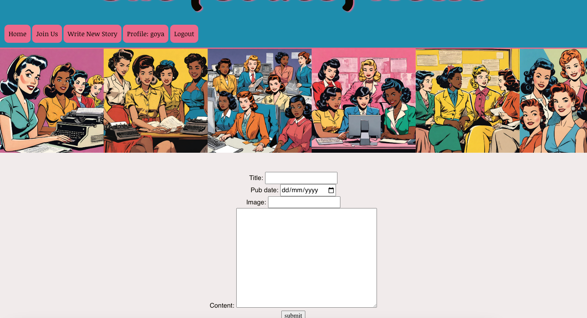

# Goya - She Codes News Project
## About This Project
This project was created as the Django project for She Codes Plus 2023/2024. 
## How To Run This Code
Django 4.2.2
1. Clone repo
2. Start venv
3. Migrate data with `python manage.py runserver`

## Database Schema

## Project Features
- [x] Order stories by date

- [x] Styled "new story" form

- [x] Story images

- [x] Log-in/log-out

- [x] "Account view" page

- [x] "Create Account" page

- [x] View stories by author

- [x] "Log-in" button only visible when no user is logged in/"Log-out" button only visible when a user *is* logged in

- [x] "Create Story" functionality only available when user is logged in

## Additional Features:
- [x] Add the ability to comment on stories within the story page

- [x] Gracefully handle the error where someone tries to create a new story when they are not logged in.

## Future Ideas:
- [ ] Dark mode feature toggle
- [ ] Add the ability to update and delete stories 
- [ ] Add the ability for user to edit and delete account
- [ ] Add the ability to “favourite” stories and see a page with your favourite
- [ ] Category or keyword search function

